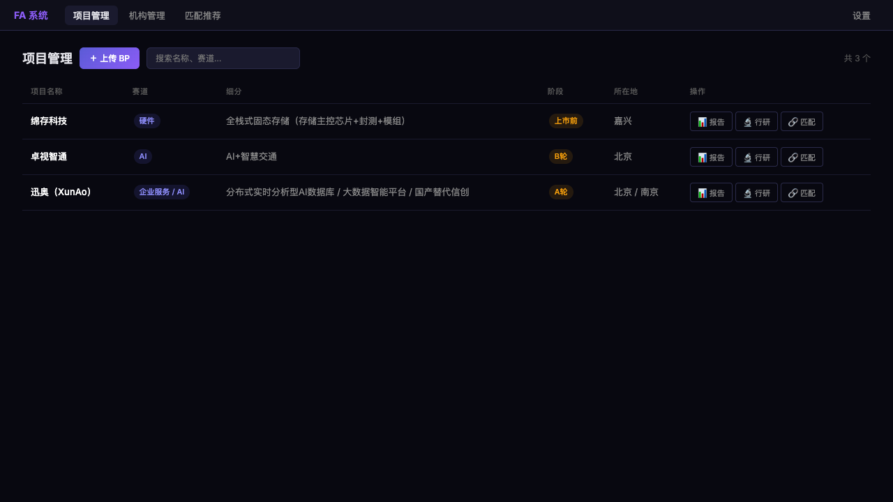
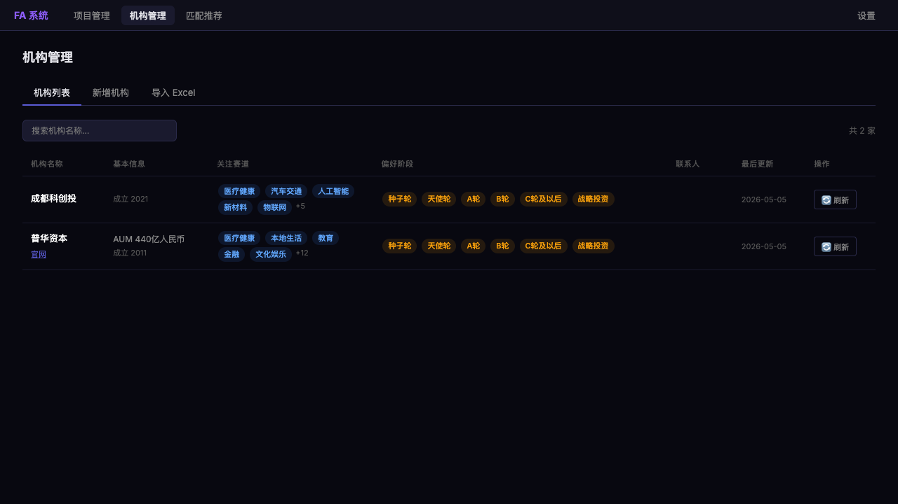
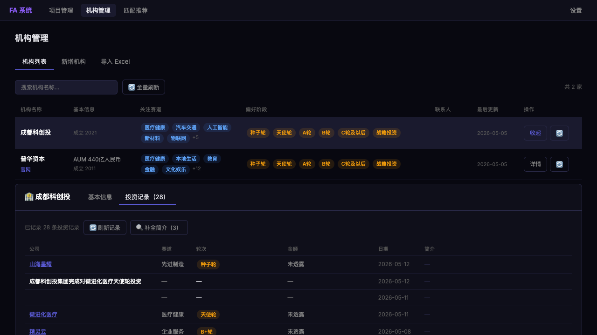
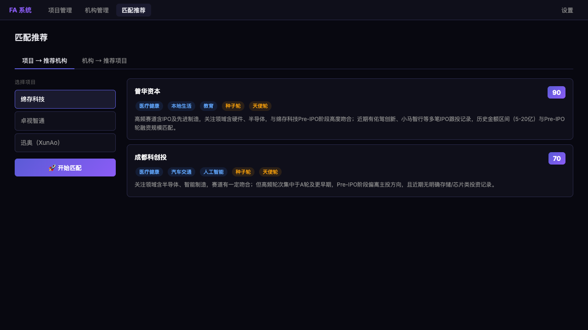

<div align="center">

# FA 智能匹配系统

**专为财务顾问（FA）设计的 AI 驱动项目-机构匹配平台**

[](https://python.org)
[](https://fastapi.tiangolo.com)
[](https://react.dev)
[](https://typescriptlang.org)
[](https://anthropic.com)
[](LICENSE)

[功能特性](#功能特性) · [界面预览](#界面预览) · [快速开始](#快速开始) · [技术架构](#技术架构) · [项目结构](#项目结构)

</div>

---

## 简介

FA 智能匹配系统是一款面向**股权融资中介机构（FA）**的 AI 工具，核心解决三个痛点：

- **BP 信息手工录入慢** → 上传 PDF/PPT，AI 秒级提取结构化信息
- **机构画像积累难** → 自动抓取投资记录，LLM 生成偏好画像
- **匹配靠人脑记忆** → 多维度 AI 评分，输出带理由的推荐排名

系统采用 **React + FastAPI** 的现代 SPA 架构，暗色专业 UI，所有长任务（抓取/LLM 调用）均为异步 Job 轮询，不阻塞界面。

---

## 界面预览

### 项目管理 — BP 上传与结构化提取

> 支持 PDF / PPT 格式，AI 自动识别赛道、阶段、融资金额、所在地等字段



---

### 机构管理 — 机构库与投资偏好标签

> 从 IT桔子自动抓取历史投资记录，展示关注赛道、偏好阶段等标签



---

### 机构详情 — 投资记录全览

> 内嵌详情面板，查看历史投资事件（公司、赛道、轮次、金额、日期），支持 LLM 批量补全简介



---

### 匹配推荐 — AI 双向匹配

> 赛道吻合 × 轮次吻合 × 金额区间 × 地域偏好，Top 10 机构带评分与具体推荐理由



---

## 功能特性

### BP 智能解析
- 上传 PDF 或 PPT 格式的商业计划书
- Claude LLM 提取：项目名称、赛道/细分、融资阶段、金额、所在地、核心描述
- 一键生成**投资价值分析报告**与**行业研究摘要**

### 机构库管理
- 手动新增 / Excel 批量导入机构
- 自动从 IT桔子抓取历史投资事件（公司名、赛道、轮次、金额、日期）
- AI 批量补全被投企业简介
- 内嵌可编辑详情面板（官网、AUM、合伙人、联系方式等）

### AI 双向匹配
| 模式 | 描述 |
|------|------|
| **项目 → 推荐机构** | 选定项目，自动从机构库匹配最适合的投资方，输出 Top 10 + 评分 + 理由 |
| **机构 → 推荐项目** | 选定机构，从项目库中找出最符合其偏好的融资标的 |

评分维度（按优先级）：赛道吻合 → 轮次吻合 → 金额区间 → 地域偏好

### 异步任务架构
所有耗时操作（LLM 调用、网页抓取）均返回 `job_id`，前端每 2 秒轮询状态，完成后自动刷新，不阻塞 UI。

---

## 技术架构

```
┌─────────────────────────────────────────────┐
│              浏览器 (React SPA)               │
│  Projects │ Institutions │ Matching │ Settings│
└──────────────────┬──────────────────────────┘
                   │ HTTP / REST
┌──────────────────▼──────────────────────────┐
│           FastAPI  (:8000)                   │
│  /api/projects  /api/institutions            │
│  /api/matching  /api/jobs  /api/settings     │
└──────┬───────────┬──────────────────────────┘
       │           │
┌──────▼───┐  ┌────▼───────────────────────────┐
│ SQLite   │  │         core/                   │
│  DB      │  │  bp_parser  · scraper           │
└──────────┘  │  matcher    · enricher          │
              │  researcher · llm               │
              └────────────────────────────────┘
                           │
              ┌────────────▼───────────┐
              │  Anthropic Claude API  │
              │  browser-harness       │
              └────────────────────────┘
```

---

## 快速开始

### 环境要求
- Python 3.11+
- Node.js 20+
- Anthropic API Key

### 1. 克隆仓库

```bash
git clone https://github.com/ChenQifei027/fa-matching.git
cd fa-matching
```

### 2. 配置环境变量

```bash
cp .env.example .env
# 编辑 .env，填入：
# ANTHROPIC_API_KEY=sk-ant-...
```

### 3. 安装后端依赖

```bash
python -m venv .venv
source .venv/bin/activate    # Windows: .venv\Scripts\activate
pip install -r requirements.txt
playwright install chromium
```

### 4. 启动后端

```bash
uvicorn api.main:app --reload --port 8000
```

### 5. 安装并启动前端

```bash
cd frontend
npm install
npm run dev
# 访问 http://localhost:5173
```

---

## 项目结构

```
fa-matching/
├── api/                    # FastAPI 路由层
│   ├── main.py             # 应用入口、CORS 配置
│   ├── jobs.py             # 异步 Job 注册表
│   └── routers/
│       ├── projects.py     # 项目 CRUD + 报告/行研
│       ├── institutions.py # 机构 CRUD + 抓取
│       ├── matching.py     # AI 匹配接口
│       ├── settings.py     # 配置读写
│       └── jobs.py         # Job 状态轮询
│
├── core/                   # 业务逻辑层（无 HTTP 依赖）
│   ├── bp_parser.py        # PDF/PPT 解析 + LLM 结构化提取
│   ├── scraper.py          # IT桔子网页抓取
│   ├── matcher.py          # AI 匹配评分逻辑
│   ├── enricher.py         # LLM 批量补全简介
│   ├── researcher.py       # 行业研究生成
│   ├── database.py         # SQLite 数据访问层
│   └── llm.py              # Claude API 封装
│
├── frontend/               # React 19 + TypeScript + Vite
│   └── src/
│       ├── pages/          # Projects / Institutions / Matching / Settings
│       ├── components/     # Badge / Modal / Spinner / TopNav
│       ├── api/            # 类型化 API 客户端
│       └── styles/         # CSS 变量设计系统（暗色主题）
│
├── tests/                  # pytest 单元测试
└── data/                   # SQLite 数据库（gitignored）
```

---

## 设计理念

**暗色专业 UI**：采用 Linear 风格设计语言，CSS 自定义属性统一管理色彩系统（`--bg-base: #080810`、`--accent: #5b5bd6`），无第三方 UI 框架，0 运行时 CSS 依赖。

**Core 层与 API 层严格解耦**：`core/` 内所有函数均可独立调用和测试，`api/` 只做参数校验和 Job 调度，业务逻辑不泄漏进路由。

**异步优先**：LLM 调用、网页抓取均为 `202 + job_id` 模式，前端轮询 `/api/jobs/{id}`，彻底避免 HTTP 超时。

---

## License

[MIT](LICENSE)
